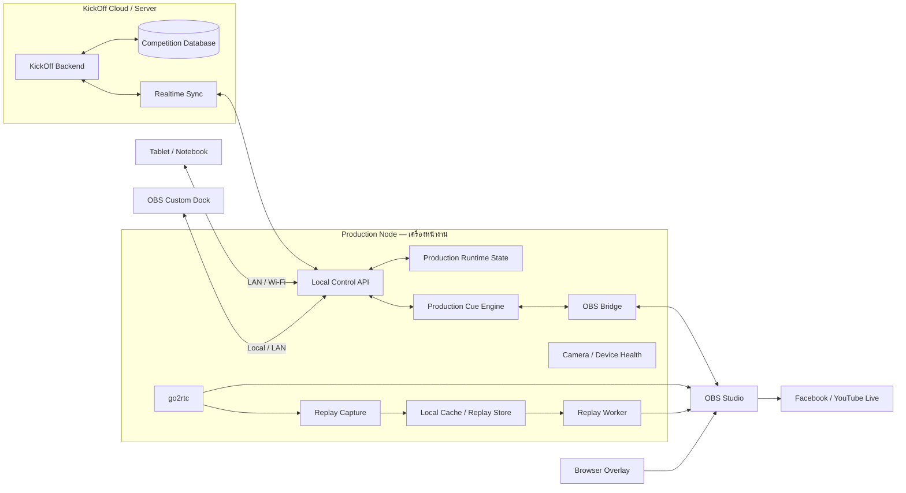
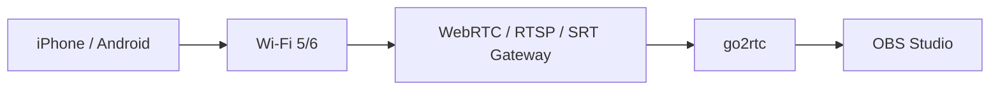
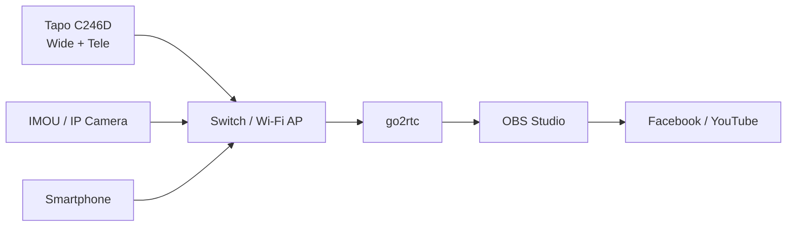
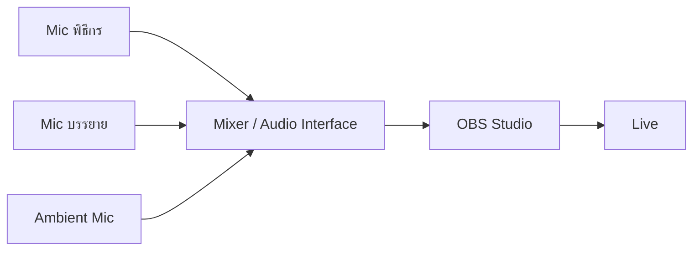
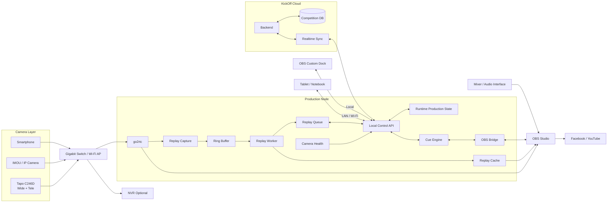

# KickOff Live Production + OBS
## Master Plan / AI Analysis Guide — Version 4

> ระบบหลัก: `kickoff.bwd.ac.th`  
> เป้าหมาย: ต่อระบบ KickOff เดิมเข้ากับ OBS Studio เพื่อใช้ถ่ายทอดสดการแข่งขันดวลจุดโทษ โดยควบคุมคะแนน กล้อง Scene กราฟิก Logo/Sponsor แถบวิ่ง Replay และสถานะอุปกรณ์จาก OBS Custom Dock หรือ Tablet ได้
>
> หลักสำคัญ: **KickOff = Competition Source of Truth / Production Node = Runtime Production State / Camera-Agnostic / Stability First / Local-First Control**

---

# 1) สิ่งที่ AI ต้องทำก่อนเขียนโค้ด

ให้ทำหน้าที่เป็น Senior Full-stack Engineer + System Architect + OBS Integration Engineer และ **วิเคราะห์ repository ก่อนแก้ source code**

ต้องตรวจ:
- Frontend / Backend / framework / `package.json`
- Database / ORM / schema / migrations
- Authentication / Authorization / Roles
- Tournament / Match / Team / Athlete / Penalty / Score
- API / Realtime (WebSocket, SSE, Socket.IO ฯลฯ)
- Dashboard / UI components
- Deployment / Docker / PM2 / systemd / reverse proxy
- Environment variables
- go2rtc เดิม ถ้ามี
- Camera integration เดิม
- OBS integration เดิม ถ้ามี

ห้าม:
- สร้างระบบ Match/Team/Athlete ซ้ำกับของเดิม
- hardcode Scene, IP กล้อง หรือ credential ใน frontend
- เปิด OBS WebSocket ออก Internet โดยตรง
- ให้ OBS หรือ Overlay เป็น Source of Truth
- ทำ breaking database change โดยไม่มี migration plan

---

# 2) Architecture หลัก — Production Node

สถาปัตยกรรม Version 4 ให้เพิ่ม **Production Node** เป็นหัวใจของระบบหน้างาน แทนการมอง OBS Bridge เป็น service เดี่ยว



## 2.1 แยก Source of Truth เป็น 2 ประเภท

### KickOff = Competition Source of Truth

เก็บข้อมูลที่เป็นความจริงของการแข่งขัน:

```text
Tournament
Match
Team
Athlete
Penalty Result
Score
Winner
Competition Event
Logo / Sponsor Configuration
```

### Production Node = Runtime Production State

เก็บสถานะหน้างานที่เปลี่ยนเร็วและไม่ควรเขียน Database หลักทุกวินาที:

```text
OBS Connected / Disconnected
Current Scene
Camera Online / Offline
Last Frame Time
Replay Rendering Status
Recording Status
Stream Status
Local Cache
Current Production Cue
Device Health
```

**ห้ามนำสถานะ runtime เช่น camera heartbeat ไปเขียน competition database ทุก frame**

## 2.2 Local-First Control

Tablet และ OBS Dock ต้องสามารถคุยกับ Production Node ผ่าน LAN ได้โดยตรง

```text
Tablet
  ↓ LAN / Wi-Fi
Production Node
  ↓
OBS / Camera / Replay
```

KickOff Cloud ทำหน้าที่ sync ข้อมูลการแข่งขันและรับผลกลับเมื่อ network พร้อม

เป้าหมายคือ:

- Internet ขาด → ยังเปลี่ยน Scene ได้
- Internet ขาด → ยังเลือกกล้องได้
- Internet ขาด → Replay ยังทำงานได้
- Internet ขาด → OBS / go2rtc ยังทำงานได้
- เมื่อ Internet กลับมา → sync state ที่จำเป็นกลับ KickOff อย่างปลอดภัย

ต้องออกแบบ conflict strategy ก่อน implement offline mutation

---

# 3) Camera-Agnostic

ระบบต้องรองรับหลายแหล่งภาพ:

```text
Camera Sources
├── Tapo
│   └── C246D
│       ├── Wide
│       └── Tele
├── IMOU
├── Generic IP Camera
│   ├── RTSP
│   └── ONVIF
└── Smartphone
    ├── iPhone
    └── Android
```

## Phase แรก
ใช้ **Tapo C246D ที่มีอยู่** ทดลองก่อนซื้อ IMOU เพิ่ม

```text
Tapo C246D
  ├── Wide
  └── Tele
       ↓
     go2rtc
       ↓
      OBS
```

Config ต้องปรับได้ ไม่ผูกกับ URL ตายตัว

```yaml
cameras:
  - id: tapo_c246d_01
    vendor: tapo
    streams:
      wide: ${TAPO_C246D_WIDE_RTSP}
      tele: ${TAPO_C246D_TELE_RTSP}
```

---

# 4) Smartphone เป็นกล้องเสริม

รองรับ iPhone/Android เป็น Roaming Camera

เหมาะกับ:
- กองเชียร์
- สัมภาษณ์
- Reaction
- พิธีเปิด
- ข้างสนาม
- ภาพเคลื่อนที่



Source:
```text
CAM_MOBILE_01
CAM_MOBILE_02
```

ใช้เป็นกล้องเสริมก่อน ไม่ใช้เป็นกล้องหลักจนกว่าจะผ่าน Stability Test

## Advanced
วางทางต่อยอด QR Camera Join:

```text
Scan QR
→ kickoff.bwd.ac.th/camera/join/{token}
→ อนุญาตกล้อง
→ เลือก Back Camera
→ Start
→ OBS เห็น CAM_MOBILE_01
```

ต้องมี signed token, expiry, revoke และ permission control

---

# 5) go2rtc

ใช้เป็น Camera Gateway ถ้าเหมาะกับระบบเดิม

```text
Camera
  ↓
RTSP / WebRTC
  ↓
go2rtc
  ↓
OBS
```

เป้าหมาย:
- local restream
- reconnect
- preview/monitor
- ลดการกระจาย credential
- OBS ไม่ต้องรู้รายละเอียดทุกกล้อง

ถ้าโปรเจกต์มี go2rtc อยู่แล้ว ให้ reuse

---

# 6) Video Flow



NVR เป็น Optional และไม่ควรเป็น dependency ของ OBS

---

# 7) Scene และ Source

## Scene
```text
01_START
02_FIELD
03_SHOOTER
04_GOAL
05_CROWD
06_MOBILE
07_INTERVIEW
08_REPLAY
09_RESULT
10_SPONSOR
11_BREAK
```

## Source
```text
CAM_WIDE
CAM_TELE
CAM_GOAL
CAM_MOBILE_01
CAM_MOBILE_02
SCOREBOARD
LOWER_THIRD
EVENT_LOGO
SPONSOR_LOGO
RUNNING_TICKER
RESULT_GRAPHIC
REPLAY_MEDIA
```

ห้าม hardcode ชื่อ Scene ใน business logic

ใช้ logical mapping:

```json
{
  "field": "02_FIELD",
  "shooter": "03_SHOOTER",
  "goal": "04_GOAL",
  "crowd": "05_CROWD",
  "mobile": "06_MOBILE",
  "replay": "08_REPLAY",
  "result": "09_RESULT"
}
```

---

# 8) OBS Custom Dock + Tablet Control — Local First

ให้ Live Control หน้าเดียวกัน responsive ใช้ได้ทั้ง:

- OBS Custom Browser Dock
- Tablet
- Notebook
- Desktop

Concept:

```text
Tablet / OBS Dock
      ↓ LAN / Wi-Fi
Production Node Local Control API
      ↓
OBS / Camera / Replay / Graphics
      ↕
KickOff Sync
```

หาก architecture จริงจำเป็นต้องใช้ URL จาก KickOff ให้ AI ต้องออกแบบ local production endpoint หรือ local proxy ที่ทำงานได้เมื่อ WAN มีปัญหา

ความสามารถ:

- เลือก Match
- เลือก Shooter
- Goal / Miss / Undo / Next
- เปลี่ยน Scene
- เลือกกล้อง
- Show/Hide Overlay
- Logo / Sponsor
- Running Ticker
- Replay Editor
- Replay Queue
- Result / Winner
- OBS Status
- Camera Status
- Recording Status
- Internet / Sync Status
- AUTO MODE ON/OFF

ตัวอย่าง:

```text
MATCH
[เลือกคู่แข่งขัน]

SCORE
[GOAL] [MISS] [UNDO] [NEXT]

CAMERA
[FIELD] [SHOOTER] [GOAL] [CROWD] [MOBILE]

GRAPHICS
[SCOREBOARD] [LOWER THIRD] [LOGO] [SPONSOR] [TICKER]

REPLAY
[CANDIDATES] [EDITOR] [QUEUE] [PLAY]

PRODUCTION
[AUTO ON/OFF] [RESULT] [BREAK]

STATUS
OBS 🟢  CAM 🟢  REC 🟢  SYNC 🟢
```

## 8.1 Operating Principle

Tablet ต้องไม่จำเป็นต้องเข้า OBS โดยตรง  
Tablet สั่ง Production Node แล้ว Production Node เป็นตัวจัดการ OBS, Replay และ Production Runtime State

## 8.2 Internet Failure

เมื่อ WAN ขาด UI ต้องแสดงชัดเจน:

```text
KickOff Cloud   🔴 Offline
Local Control   🟢 Ready
OBS             🟢 Connected
Camera          🟢 Ready
Replay          🟢 Ready
```

Operator ต้องยังทำงาน Production ต่อได้

---

# 9) Logo / Sponsor

ต้องเปลี่ยนระหว่าง Live ได้

```text
EVENT_LOGO
TEAM_HOME_LOGO
TEAM_AWAY_LOGO
SPONSOR_LOGO
PARTNER_LOGO
SCHOOL_LOGO
```

Control:
```text
[EVENT LOGO ON/OFF]
[SPONSOR A ON/OFF]
[SPONSOR B ON/OFF]
[NEXT SPONSOR]
```

---

# 10) Running Ticker / โลโก้วิ่ง

เพิ่มในแผนแล้ว

รองรับ:
- ข้อความประกาศ
- โปรแกรมการแข่งขัน
- รายชื่อผู้สนับสนุน
- ข่าวประชาสัมพันธ์
- Sponsor carousel
- Running Logo

ตัวอย่าง:

```text
[LIVE] ดวลจุดโทษบ่อพลอย ครั้งที่ 5 • คู่ต่อไป ... • สนับสนุนโดย ...
```

Control:
```text
[TICKER ON]
[TICKER OFF]
[เปลี่ยนข้อความ]
[SPONSOR ROTATION]
```

---

# 11) Browser Overlay

URL concept:

```text
/live/overlay/{matchId}
```

ต้อง:
- Transparent background
- 1920x1080 safe area
- Realtime
- No scrollbar / navigation
- Reconnect ได้
- Recovery หลัง refresh
- Signed overlay token

Components:
```text
ScoreBug
PenaltyDots
TeamLogo
TeamName
CurrentShooter
LowerThird
GoalAnimation
MissAnimation
WinnerAnimation
MatchResult
EventLogo
SponsorLogo
RunningTicker
SponsorCarousel
```

---

# 12) Penalty Tracker

รองรับ:
- First 5 kicks
- Sudden Death
- Goal
- Miss
- Undo
- Edit
- Winner detection

State:

```text
READY
→ SHOOTER_SELECTED
→ ATTEMPT_ACTIVE
→ GOAL / MISS
→ ATTEMPT_CONFIRMED
→ NEXT_SHOOTER
→ SUDDEN_DEATH / MATCH_COMPLETE
```

---

# 13) Undo + Duplicate Click Protection

Undo เป็น First-Class Feature

Event log ควรเก็บ before/after

```json
{
  "event": "PENALTY_GOAL",
  "matchId": "xxx",
  "teamId": "xxx",
  "playerId": "xxx",
  "before": {},
  "after": {},
  "createdBy": "user-id",
  "createdAt": "..."
}
```

ป้องกันการกด Goal ซ้ำด้วย:
- attempt ID
- idempotency key
- transaction
- server validation
- disable button ขณะ pending

---

# 14) Local OBS Bridge

```text
KickOff
   ↓
Local OBS Bridge
   ↓
127.0.0.1:4455
   ↓
OBS Studio
```

ต้องทำ:
- connect / disconnect / reconnect
- connection status
- list scenes
- switch scene
- show/hide source
- refresh browser source
- trigger media
- start/stop recording
- stream status
- replay trigger

OBS WebSocket ต้อง local/LAN + password + firewall  
**ห้าม expose public internet**

---

# 15) Replay Editor / Replay Production

## เป้าหมาย
Replay ไม่ใช่แค่กดเล่นคลิปย้อนหลัง แต่เป็น **Replay Editor** ที่เลือกคลิป กำหนดช่วงเวลา ซูม และความเร็วได้ก่อนส่งเข้า OBS

Architecture concept:

```text
Source Video
   ↓
Replay Editor
   ├── เลือกไฟล์
   ├── กำหนด IN / OUT
   ├── เลือก Speed
   ├── เลือก Zoom / Focus
   ├── เลือก Audio Mode
   ├── Preview
   └── Render / Cache Clip
          ↓
        OBS
          ↓
     Scene: REPLAY
```

## ความสามารถขั้นต่ำของ Replay Editor v1
- เลือกไฟล์วิดีโอ
- Preview ก่อนเล่น
- ตั้งช่วงเวลา `IN / OUT`
- กำหนดวินาทีได้ละเอียดระดับทศนิยม
- เลือก Speed preset
- เปิด/ปิด Zoom
- กำหนดจุดโฟกัส (focus position)
- เลือก Audio mode
- Render clip แบบ cache
- ส่งคลิปเข้า OBS แล้วเล่นที่ Scene REPLAY
- Auto return กลับ Scene Live หลังเล่นจบ

## ตัวอย่าง UI
```text
REPLAY EDITOR

ไฟล์:
[ CAM_GOAL_001.mp4 ▼ ]

Timeline
00:00 ───────●════════════●───── 00:20
             IN           OUT

IN   = 12.40
OUT  = 18.75

SPEED
[ 1.0x ] [ 0.75x ] [ 0.50x ] [ 0.25x ]

ZOOM
[ OFF / ON ]
Zoom %  [100 - 200]

FOCUS
X = ...
Y = ...

AUDIO
[ Original ] [ Mute ] [ -12dB ] [ Use Live Audio ]

[ PREVIEW ]
[ PLAY REPLAY ]
```

## Speed ที่ต้องรองรับ
อย่างน้อย preset ต่อไปนี้:
- `1.00x`
- `0.75x`
- `0.50x`
- `0.25x`

อนาคตอาจเพิ่ม custom slider เช่น `0.10x – 1.00x`

## Zoom / Focus
Replay ต้องรองรับ:
- เปิด/ปิด Zoom
- เลือกเปอร์เซ็นต์การซูม
- เลือกตำแหน่งโฟกัส
- ในอนาคตอาจรองรับ pan/zoom animation

ตัวอย่าง metadata:

```json
{
  "zoom": 1.7,
  "focusX": 72,
  "focusY": 48
}
```

## Audio Mode
Replay ต้องมีอย่างน้อย:
- `original`
- `mute`
- `ducked`
- `use_live_program_audio`

สำหรับ slow motion ควรรองรับการปิดเสียงคลิปและใช้เสียงบรรยายสดต่อแทน

## Non-Destructive Editing
ห้ามแก้ไฟล์ต้นฉบับโดยตรง  
ให้เก็บ **Replay Recipe** แล้วค่อย render เป็น cache clip

ตัวอย่าง:

```json
{
  "source": "CAM_GOAL_001.mp4",
  "in": 12.4,
  "out": 18.75,
  "speed": 0.5,
  "zoom": 1.7,
  "focusX": 72,
  "focusY": 48,
  "audio": "mute"
}
```

จากนั้นระบบสร้างไฟล์ cache เช่น:

```text
cache/replay_5831.mp4
```

## OBS Playback Flow
```text
Operator กด PLAY REPLAY
      ↓
Replay Editor สร้าง/โหลด cache clip
      ↓
OBS Bridge อัปเดต Media Source
      ↓
Scene → REPLAY
      ↓
Restart Media
      ↓
Play
      ↓
Auto Return → FIELD / LIVE
```

## Replay Preset
ควรมี preset หน้างานเพื่อกดเร็ว เช่น:
- GOAL REPLAY
- SAVE REPLAY
- HIGHLIGHT

ตัวอย่าง:
```text
GOAL REPLAY
ย้อนหลัง 6 วินาที
0.5x
Zoom 140%
```


## Replay Capture / Ring Buffer — ต้องเพิ่มใน Version 4

Replay Editor ต้องไม่เริ่มจากการให้ Operator ไปค้นหาไฟล์ด้วยตัวเองเป็นหลัก

ให้มี Replay Capture Service รับภาพจาก camera streams ต่อเนื่อง:

```text
Camera
  ↓
go2rtc
  ├── OBS
  └── Replay Capture
         ↓
      Ring Buffer
         ↓
   Short Video Segments
```

แนวทาง segment เช่น:

```text
CAM_WIDE/
  13-42-10.mp4
  13-42-15.mp4
  13-42-20.mp4

CAM_TELE/
  13-42-10.mp4
  13-42-15.mp4
  13-42-20.mp4
```

ระบบต้องกำหนด:
- segment duration
- retention window
- maximum disk usage
- cleanup policy
- timestamp strategy
- camera/source ID
- codec / FPS / resolution metadata

NVR ยังใช้เป็น Archive ได้ แต่ Replay สดไม่ควรพึ่ง NVR เป็น dependency หลัก

## Event Timestamp + Replay Candidate

เมื่อ Operator กด GOAL / MISS / SAVE / HIGHLIGHT ให้สร้าง Event Timestamp ทันที

ตัวอย่าง:

```json
{
  "type": "GOAL",
  "matchId": "match-001",
  "occurredAt": "2026-08-18T13:42:18.350+07:00",
  "source": "operator",
  "playerId": "player-10"
}
```

จาก timestamp นี้ Replay Service เตรียม candidate จากหลายกล้องโดยอัตโนมัติ

```text
GOAL @ 13:42:18.350

[ WIDE ]   13:42:12.350 → 13:42:20.350
[ TELE ]   13:42:12.350 → 13:42:20.350
[ GOAL ]   13:42:12.350 → 13:42:20.350
[ MOBILE ] 13:42:12.350 → 13:42:20.350
```

Operator เลือกมุมที่ดีที่สุด แล้วค่อยปรับ IN / OUT

## Pre-roll / Post-roll

Replay Recipe ต้องรองรับการอ้างอิงจาก Event Time

ตัวอย่าง:

```json
{
  "eventTime": 0,
  "preRollSeconds": 6,
  "postRollSeconds": 2
}
```

ค่าเริ่มต้นแนะนำให้ config ได้ตามประเภท cue เช่น:

```text
GOAL      = -6s / +2s
SAVE      = -5s / +2s
HIGHLIGHT = -8s / +3s
```

## Video Metadata / FPS Awareness

Replay Editor ต้องอ่าน metadata:

```text
Resolution
FPS
Codec
Duration
Camera ID
Capture Timestamp
```

Slow Motion ต้องคำนึงถึง FPS ต้นฉบับ

แนวทาง UX:

```text
Source = 60 fps
0.50x  → Recommended
0.25x  → Usable

Source = 25/30 fps
0.75x  → Recommended
0.50x  → Warning
0.25x  → Strong Warning / may look choppy
```

Advanced Phase ค่อยพิจารณา:
- frame interpolation
- optical flow

## Replay Worker — แยกจาก OBS

ห้ามให้ OBS process ทำงาน render หนักโดยตรง

```text
Replay Recipe
     ↓
Replay Worker
├── Trim
├── Speed
├── Crop / Zoom
├── Audio
└── Encode
     ↓
Replay Cache
     ↓
OBS Media Source
```

Replay Worker ต้อง:
- มี job status
- cancel ได้
- timeout
- จำกัด concurrent render
- monitor CPU/GPU
- ไม่ทำให้ OBS encoding สะดุด

หาก render ช้า:

```text
⚠ Replay ยังไม่พร้อม

[เล่น Original]
[รอต่อ]
[ยกเลิก]
```

Live ต้องไม่ค้างเพื่อรอ Replay

## Replay Queue

ต้องมี Queue สำหรับเหตุการณ์ที่เกิดเร็วต่อเนื่อง

```text
REPLAY QUEUE

#1 GOAL บ้านวังด้ง        READY
#2 SAVE บ้านหนองหว้า      RENDERING
#3 MISS                    CANDIDATE
```

Queue item ควรมี:
- event
- match
- player/team
- timestamp
- selected camera
- recipe
- render status
- preview
- played / not played

## Audio Default สำหรับ Replay

Default ที่แนะนำ:

```text
Replay Clip Audio = Mute
Commentator / MC  = Live ต่อ
Program Audio     = ไม่ถูกตัด
```

Operator สามารถ override เป็น:
- Original
- Mute
- Duck -12dB
- Use Live Program Audio

**Scene REPLAY ต้องไม่ตัดไมค์ผู้บรรยายโดยอัตโนมัติ**

## Multi-camera Replay Concept

Replay candidate จากเหตุการณ์เดียวกันต้องสามารถเลือกหลายมุมได้:

```text
[ WIDE ]
[ TELE ]
[ GOAL ]
[ MOBILE ]
```

Version แรกเลือก 1 มุม  
Advanced รองรับ sequence หลายมุมใน Replay เดียว

## Production Cue Engine

เพิ่มชั้น `Cue Engine` ระหว่าง action ของ Operator กับ production commands

ตัวอย่าง:

```text
CUE: GOAL

1. Validate penalty attempt
2. Save GOAL
3. Update Score
4. Trigger GOAL Overlay
5. Mark Replay Event Timestamp
6. Scene → CROWD / MOBILE (optional)
7. Prepare Replay Candidates
```

```text
CUE: NEXT_SHOOTER

1. Set current shooter
2. Lower Third ON
3. Scene → SHOOTER
4. Wait configured duration
5. Lower Third OFF
```

ต้องมี:

```text
AUTO MODE [ON/OFF]
```

เมื่อ AUTO OFF:
- Operator สั่ง Scene / Graphic เอง
- Competition data ยังบันทึกตามปกติ

เมื่อ AUTO ON:
- Cue Engine ทำ sequence ตาม preset
- Operator ต้อง override ได้เสมอ

Cue preset ต้อง config ได้ ไม่ hardcode

## Future Replay Features
- Instant Replay Buffer
- Auto detect latest clip
- Multi-camera Replay
- Frame-by-frame selection
- Keyframe Zoom
- Pan / Zoom animation
- Replay Preset Manager
- Auto Highlight Builder

---

# 16) Camera Fallback

Version แรกทำ Manual Fallback

```text
CAM_TELE 🔴 Offline

[ใช้ CAM_WIDE แทน]
```

สถานะ:

```text
CAM_WIDE       🟢
CAM_TELE       🟢
CAM_GOAL       🟡
CAM_MOBILE_01  🟢
CAM_MOBILE_02  🔴
```

---

# 17) Production Preflight

ก่อน Live ต้องเห็น:

```text
OBS              🟢 Connected
OBS WebSocket    🟢 Connected
Overlay          🟢 Connected

CAM_WIDE         🟢
CAM_TELE         🟢
CAM_MOBILE       🟢 / Optional

Audio            🟢
Recording Disk   🟢
Internet         🟢
```

---

# 18) Audio

ไม่ใช้เสียงจากกล้องเป็นเสียงหลัก



Channel:
```text
CH1 = MC
CH2 = Commentator
CH3 = Ambient
CH4 = Music / Jingle
CH5 = Computer Media
```

OBS Audio Checklist:
- Gain
- Noise Suppression
- Compressor
- Limiter
- Monitoring
- Sync Offset

ต้องทำ Clap Test เพื่อปรับ Audio/Video Sync

---

# 19) Network

หลัก:

```text
Camera Traffic = Local LAN
Live Upload = Internet WAN
```

Internet ขาดไม่ควรทำให้ Camera LAN / OBS Preview / NVR พัง

แนะนำ:
- Gigabit LAN กับ OBS PC
- Wi-Fi AP คุณภาพดีสำหรับ Tapo/Smartphone
- Backup Internet
- UPS
- VLAN เป็น Optional ในอนาคต

---

# 20) สเปกคอมพิวเตอร์ OBS

## ขั้นต่ำ
```text
CPU: Intel Core i5 Gen10+ / Ryzen 5 3600+
RAM: 16GB
Storage: NVMe 500GB
GPU: GTX 1650 / RTX 3050 หรือ Quick Sync ที่เหมาะสม
Network: Gigabit LAN
```

## แนะนำสำหรับใช้งานจริง
```text
CPU: Intel Core i5-13400 class / Ryzen 7 5700G class ขึ้นไป
RAM: 32GB
System SSD: NVMe 1TB
GPU: RTX 3060 / RTX 4060 class หรือเทียบเท่า
Network: Gigabit LAN
Monitor: 2 จอ
Power: UPS
```

## Replay / Multi-camera / หลายกราฟิก
```text
CPU: Intel Core i7-12700 class+ / Ryzen 7 7700 class+
RAM: 32–64GB
System: NVMe 1TB
Recording: SSD/HDD 2TB+ แยกจากระบบถ้าเป็นไปได้
GPU: RTX 4060 class+
Monitor: 2 จอขึ้นไป
UPS
```

---

# 21) Phase 0 — Production Lab

**ห้ามข้าม**

ทดสอบ:
```text
[ ] Tapo C246D Wide
[ ] Tapo C246D Tele
[ ] เปิดสอง stream พร้อมกัน
[ ] go2rtc reconnect
[ ] OBS scene switch
[ ] OBS recording
[ ] Overlay
[ ] Tablet control
[ ] CPU/GPU usage
[ ] Network stability
[ ] latency
[ ] audio sync
```

Stress Test อย่างน้อย 2–3 ชั่วโมง

Full Load:
```text
Wide + Tele
+ Mobile Camera
+ Overlay
+ Audio
+ OBS Recording
+ Live Streaming
+ KickOff Control
```

---

# 22) Roadmap — แบ่ง Scope ใหม่

เพื่อไม่ให้ Version แรกใหญ่เกินไป ให้แบ่งเป็น 5 ระดับ

## Phase 0 — Production Lab

พิสูจน์ infrastructure ก่อน:

- Tapo C246D Wide / Tele
- go2rtc
- OBS
- Local Production Node
- LAN Tablet Control
- Audio Sync
- Recording
- Stress Test 2–3 ชั่วโมง
- ทดสอบ WAN ขาดระหว่างทำงาน

## MVP — ใช้ Live งานจริงได้เร็วที่สุด

```text
KickOff Match
+ Score
+ Penalty
+ Undo
+ Realtime Overlay
+ Tablet Control
+ OBS Scene Switch
```

Definition:
- ใช้แข่งขันจริงได้
- ไม่มี Replay ก็ยังทำงานครบ
- ไม่มี Automation ซับซ้อนก็ยังทำงานได้

## Production v1

เพิ่ม:

- Logo / Sponsor
- Running Ticker
- Production Preflight
- Camera Health
- Manual Camera Fallback
- Device Status
- Local-first control
- Production Cue Engine แบบพื้นฐาน
- AUTO MODE ON/OFF

## Replay v1

เพิ่ม:

- Replay Capture
- Ring Buffer
- Event Timestamp
- Pre-roll / Post-roll
- Replay Candidate
- เลือกมุมกล้อง
- Replay Editor
- IN / OUT
- Speed
- Zoom / Focus
- Audio Mode
- Preview
- Replay Worker
- Cache
- Replay Queue
- Play to OBS
- Auto Return Live

## Advanced

พิจารณา:

- Instant Replay
- Multi-camera Replay sequence
- Frame-by-frame
- Optical Flow / Interpolation
- Keyframe Zoom / Pan
- QR Mobile Camera Join
- PTZ
- Stream Deck
- Multi-OBS
- Multi-field
- Advanced Statistics
- Auto Camera Switching
- Auto Replay
- Highlight Builder

---

# 23) Workflow หน้างาน

```text
1. เปิด Network
2. ตรวจ Router / Switch / AP
3. ตรวจกล้อง
4. ตรวจ go2rtc
5. เปิด OBS
6. ตรวจ OBS WebSocket
7. เปิด KickOff
8. เปิด Live Control
9. เลือก Match
10. เปิด Overlay
11. ตรวจ Logo / Sponsor / Ticker
12. ตรวจ Audio
13. Clap Test
14. Test Recording
15. Test Live
16. พร้อมแข่งขัน
```

---

# 24) Workflow ขณะยิง

```text
Select Shooter
→ Show Lower Third
→ Scene SHOOTER
→ Shot
→ GOAL / MISS
→ Update Score
→ Update Penalty Dots
→ Graphic
→ Reaction / Mobile Camera
→ Optional Replay
→ Next Shooter
```

---

# 25) API / Realtime Concept

**ห้ามสร้างจนกว่าจะตรวจของเดิม**

API concept:
```text
GET  /api/live/matches/:id
GET  /api/live/matches/:id/state

POST /api/live/matches/:id/select-shooter
POST /api/live/matches/:id/goal
POST /api/live/matches/:id/miss
POST /api/live/matches/:id/undo

POST /api/live/graphics/logo
POST /api/live/graphics/sponsor
POST /api/live/graphics/ticker

POST /api/live/replay/create
POST /api/live/replay/preview
POST /api/live/replay/play

POST /api/live/obs/scene
POST /api/live/obs/source
POST /api/live/obs/replay
```

Realtime:
```text
match.state.updated
penalty.updated
score.updated
shooter.updated
overlay.updated
graphic.logo.updated
graphic.sponsor.updated
graphic.ticker.updated
replay.status
obs.command
obs.status
camera.status
audio.status
recording.status
mobile_camera.status
```

---

# 26) Security / Reliability

ต้องมี:
- Role-based permission
- Signed overlay token
- Signed mobile camera token
- Secure camera credentials
- Audit log
- OBS WebSocket local only
- Reconnect OBS / Camera / Overlay / Realtime
- Browser refresh recovery
- Idempotency
- Transaction
- Manual fallback
- Device timeout

---

# 27) Definition of Done — แบ่งตาม Release

## MVP

```text
[ ] เลือก Match ได้
[ ] แสดง Team / Logo / Score ได้
[ ] เลือก Shooter ได้
[ ] Goal / Miss ได้
[ ] Penalty Dots realtime
[ ] Undo ได้
[ ] Winner detection
[ ] Overlay realtime
[ ] OBS Browser Source ใช้งานได้
[ ] OBS Scene Switch ได้
[ ] Tablet Control ผ่าน LAN ได้
[ ] WAN ขาดแล้ว Local Production Control ยังทำงานได้
```

## Production v1

```text
[ ] OBS reconnect ได้
[ ] OBS Custom Dock ได้
[ ] เปลี่ยน Logo ได้
[ ] เปลี่ยน Sponsor ได้
[ ] Running Ticker ได้
[ ] Camera Status ได้
[ ] Manual Camera Fallback ได้
[ ] Production Preflight ได้
[ ] AUTO MODE ON/OFF
[ ] Cue Engine ขั้นพื้นฐาน
[ ] Audio Sync ตรวจสอบได้
[ ] Audit/Event Log
[ ] ไม่มี credential สำคัญใน frontend
```

## Replay v1

```text
[ ] Replay Capture ทำงานต่อเนื่อง
[ ] Ring Buffer / Segment Retention ทำงาน
[ ] Event Timestamp ถูกสร้างเมื่อเกิดเหตุการณ์
[ ] Pre-roll / Post-roll สร้าง Replay Candidate ได้
[ ] เลือก Camera Angle ได้
[ ] Replay Editor เลือก IN / OUT ได้
[ ] Speed 1.0 / .75 / .5 / .25 ได้
[ ] Zoom / Focus ได้
[ ] Audio Mode ได้
[ ] Preview ได้
[ ] Replay Worker render โดยไม่ทำ OBS สะดุด
[ ] Replay Queue ได้
[ ] Play เข้า OBS ได้
[ ] Auto Return Live ได้
[ ] Original source ไม่ถูกแก้ไข
```

## Phase 3 / Advanced

Smartphone Camera, QR Join, Multi-camera Replay, PTZ และ Automation ขั้นสูงต้องผ่าน Stability Test แยกก่อนถือเป็น Production Ready

---

# 28) Complete Production Architecture — Version 4



## Design Rule

```text
Competition Truth → KickOff
Production Runtime → Production Node
Video/Audio Output → OBS
Camera Gateway → go2rtc
Replay Source → Replay Capture/Ring Buffer
Replay Processing → Replay Worker
Operator Control → Tablet / OBS Dock ผ่าน Local API
```

## Failure Isolation

ระบบต้องออกแบบให้ failure แยกกัน:

```text
WAN Fail
→ Local Production ยังทำงาน

KickOff Cloud Fail
→ OBS / Camera / Replay ยังทำงาน

Camera 1 Fail
→ ใช้ Fallback Camera

Replay Worker Fail
→ Live ยังออกอากาศ

NVR Fail
→ OBS Live ยังทำงาน

Overlay Fail
→ Camera + Audio ยังออก Live ได้
```

---

# 29) สิ่งที่ AI ต้องส่งกลับก่อน Implement

1. Existing System Analysis
2. Existing Models
3. Reusable Components พร้อม path จริง
4. Risk Analysis
5. Proposed Architecture + Mermaid
6. รายการไฟล์ `CREATE / MODIFY / KEEP`
7. Database Migration Proposal
8. Implementation Plan: Phase 0 → MVP → Production v1 → Replay v1 → Advanced
9. Production Node Design
10. Replay Capture / Ring Buffer Design
11. Offline/LAN Sync Strategy
12. Cue Engine Design

---

# 30) คำสั่งเริ่มต้นสำหรับ AI / Codex

> วิเคราะห์ repository ปัจจุบันของ KickOff ตามเอกสาร Version 4 นี้ โดย **ยังไม่แก้ source code**
>
> ตรวจ architecture, database, API, authentication, authorization, realtime, tournament, match, team, athlete, penalty scoring, dashboard, deployment, go2rtc, camera integration และ OBS integration ที่มีอยู่
>
> ## Architecture Requirement
>
> แยก Source of Truth เป็น:
>
> - **KickOff = Competition Source of Truth**
> - **Production Node = Runtime Production State**
>
> Production Node ต้องพิจารณาประกอบด้วย:
>
> - Local Control API
> - OBS Bridge
> - go2rtc
> - Camera / Device Health
> - Replay Capture
> - Ring Buffer
> - Replay Worker
> - Replay Queue
> - Local Cache
> - Production Cue Engine
>
> Tablet และ OBS Custom Dock ต้องควบคุม Production Node ผ่าน LAN/Local Network ได้ และระบบ Production ต้องยังทำงานพื้นฐานได้เมื่อ Internet/WAN ขาด
>
> ## Camera Requirement
>
> ออกแบบ Camera-Agnostic โดยเริ่ม Production Lab ด้วย Tapo C246D Wide + Tele ผ่าน go2rtc → OBS ก่อนซื้อกล้องเพิ่ม และวางทางรองรับ IMOU / Generic RTSP / Smartphone Camera
>
> ## Replay Requirement
>
> Replay ต้องไม่บังคับให้ Operator ค้นหาไฟล์เองเป็นหลัก
>
> ให้ออกแบบ:
>
> 1. Replay Capture ต่อเนื่องจาก camera streams
> 2. Ring Buffer / short segments
> 3. Event Timestamp ตอน GOAL / MISS / SAVE / HIGHLIGHT
> 4. Pre-roll / Post-roll
> 5. Replay Candidates จาก WIDE / TELE / GOAL / MOBILE
> 6. Replay Editor เลือก IN / OUT
> 7. Speed 1.0x / .75x / .5x / .25x
> 8. Zoom / Focus
> 9. Audio Mode
> 10. Preview
> 11. Non-destructive Recipe
> 12. Replay Worker แยก process
> 13. Replay Cache
> 14. Replay Queue
> 15. Play to OBS + Auto Return Live
> 16. FPS-aware slow motion warning
>
> Replay Worker ล้มเหลวหรือ render ช้าต้อง **ไม่ทำให้ Live หยุด**
>
> ## Production Cue Requirement
>
> วาง Cue Engine เช่น GOAL / NEXT_SHOOTER และต้องมี `AUTO MODE ON/OFF` พร้อม manual override
>
> ## Scope
>
> เสนอ Implementation Plan เป็น:
>
> `Phase 0 → MVP → Production v1 → Replay v1 → Advanced`
>
> สรุป:
>
> 1. Existing System Analysis
> 2. Reusable Components พร้อม path จริง
> 3. Risks
> 4. Proposed Architecture
> 5. Production Node Design
> 6. File Changes: CREATE / MODIFY / KEEP
> 7. Database Changes
> 8. Local/WAN Sync Strategy
> 9. Replay Capture/Ring Buffer Design
> 10. Cue Engine Design
> 11. Implementation Plan
>
> **ห้าม Implement จนกว่าจะวิเคราะห์ของเดิมและเสนอ architecture เสร็จ**

---

# หลักตัดสินใจสุดท้าย

```text
เริ่มจากสิ่งที่มีอยู่
→ ทดสอบให้เสถียร
→ ทำ Core KickOff Live
→ เพิ่ม OBS + Tablet Control
→ Logo / Sponsor / Ticker
→ Production Node
→ Replay Capture / Event Timestamp
→ Replay Editor
→ Mobile Camera
→ Camera Expansion
→ Advanced Automation
```

> **เสถียรก่อน → Local Control ต้องรอด → Replay ต้องไม่รบกวน Live → ขยายได้ → แล้วจึง Automation**
