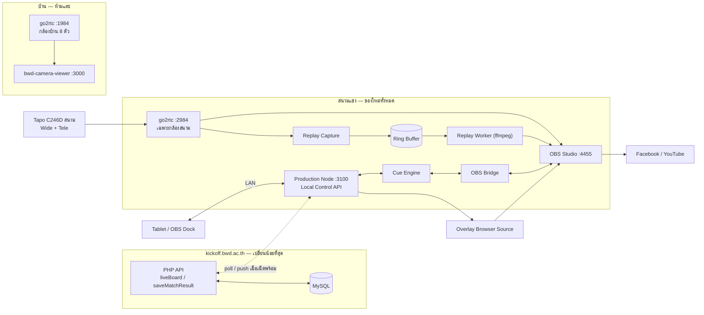

# แผนดำเนินการ — KickOff Live Production + OBS (Production Node)

> ตอบเอกสาร `KickOff_Live_Production_OBS_AI_Analysis_v4.md` §29/§30
> สถานะ: **วิเคราะห์ + เสนอสถาปัตยกรรม — ยังไม่แก้ source code ของระบบเดิม**
> โจทย์เพิ่มจากผู้ใช้: **ต้องไม่กระทบระบบเดิม** และ **reuse ของที่ทำเสร็จแล้ว**
> (`D:\HOME\bwd-camera-viewer` + `D:\HOME\go2rtc_win64`)

---

## 0) สรุปผู้บริหาร — 5 ข้อที่ต้องตัดสินใจก่อนเริ่ม

1. **`D:\HOME\go2rtc_win64` ใช้ซ้ำตรง ๆ ไม่ได้** — มันคือกล้องบ้าน 8 ตัว (ห้องนอน ห้องครัว
   ทางเดินห้องน้ำ ข้างสระ) ถ้าเอา instance นี้ไปต่อ OBS ที่กำลัง Live ลง Facebook
   การกดสลับ Scene ผิดครั้งเดียว = ออกอากาศภายในบ้าน ต้องแยก instance ใหม่เท่านั้น
2. **`bwd-camera-viewer` คือโครง Production Node ที่ใกล้เคียงที่สุดที่มีอยู่แล้ว** —
   proxy go2rtc, ซ่อน credential, PIN auth, bind `0.0.0.0` (LAN-ready), retention policy
   ครบ ให้ **fork เป็นโปรเจกต์ใหม่** ไม่ใช่แก้ของเดิม (ระบบกล้องบ้านต้องทำงานต่อ)
3. **KickOff อยู่บน PHP shared hosting → ไม่มี WebSocket** realtime ที่แท้จริงต้องเกิดที่
   Production Node เท่านั้น KickOff คงรูปแบบ poll (`liveBoard`) ตามเดิม
4. **Phase 0 + MVP แก้ `D:\PenaltyPro` เป็นศูนย์บรรทัด** — Overlay อ่าน `liveBoard`
   ที่มีอยู่แล้ว พิสูจน์ระบบได้โดยไม่แตะโค้ดที่ใช้แข่งจริงอยู่
5. **ทุกอย่างใหม่อยู่นอก repo เดิม** — โฟลเดอร์ใหม่ `D:\HOME\kickoff-production-node`

---

## 1) Existing System Analysis

### 1.1 KickOff (`D:\PenaltyPro`) — Competition Source of Truth

| หัวข้อ | ของจริงที่พบ |
|---|---|
| Frontend | React 19 + TypeScript + Vite 7 + Tailwind 3 (`package.json`) |
| Backend | PHP 8 ล้วน ไม่มี framework — router แบบ map action → ไฟล์ (`api/index.php`) |
| Database | MySQL `bwdacth_kickoff` ผ่าน PDO (`api/lib/Db.php`) |
| Auth | Bearer token → `user_sessions` / `team_sessions`, sliding expiry (`api/lib/Auth.php`) |
| Authorization | รวมศูนย์ที่ `api/lib/Perm.php` (admin / ผู้ดูแลรายการ / staff / รหัสโรงเรียน) |
| Realtime | **ไม่มี WebSocket** — poll `?action=liveBoard` + version signature (`services/liveBoard.ts`) |
| Deployment | Shared hosting, subdomain `kickoff.bwd.ac.th`, CORS allowlist ใน `api/config.php` |
| go2rtc / Camera / OBS เดิม | **ไม่มีเลยใน repo นี้** |

**ข้อจำกัดที่กำหนดสถาปัตยกรรม:** shared hosting รัน long-lived process ไม่ได้
→ WebSocket, ring buffer, ffmpeg worker, OBS bridge **เป็นไปไม่ได้บน KickOff**
ทั้งหมดต้องอยู่ที่เครื่องหน้างาน ซึ่งตรงกับแนวคิด Production Node ของเอกสารพอดี

### 1.2 Existing Models ที่ห้ามสร้างซ้ำ

`types.ts` + `api/routes/*.php` มีครบแล้ว:

```text
Tournament (tournaments)          Team (teams)
Player (players)                  Match (matches)
Kick (match_kicks)                MatchEvent (match_events)
MatchState (client runtime)       player_checkins
```

`MatchState` เพิ่งได้ `firstKicker` / `extraPhases` / `needsExtraPhase` จากงานเสี่ยงทาย
หัวก้อย — Penalty Tracker ตามเอกสาร §12 **ทำเสร็จไปแล้วเกือบทั้งหมด**

### 1.3 `bwd-camera-viewer` — Production Node ที่มีอยู่แล้ว 60%

| ส่วน | Path จริง | ใช้ต่อได้แค่ไหน |
|---|---|---|
| Express server LAN | `server.ts` → `app.listen(PORT, '0.0.0.0')` :3000 | **ใช้เป็น Local Control API ได้เลย** |
| WebRTC proxy | `server.ts:291` `POST /api/webrtc` → `127.0.0.1:1984` | **ใช้ได้เลย** |
| Snapshot จากกล้อง | `server.ts:114` → go2rtc `frame.jpeg` | ใช้เป็น thumbnail / preflight |
| Camera config | `cameras.json` + `GET/POST /api/cameras` | **ตรงกับ Camera-Agnostic §3** |
| PIN auth + session | `server/authService.ts:179` | ใช้เป็นด่าน Operator |
| Retention / cleanup | `server/snapshotCleanup.ts`, `app-config.json` | **แม่แบบ Ring Buffer retention §15** |
| PWA / SW / Push | `public/sw.js`, `src/hooks/*` | Optional |
| Face AI | `server/faceService.ts` + `src/workers/` | **ไม่ใช้** ในงาน Live |
| PTZ | `server.ts:319` → คืน 501 พร้อมคำเตือน | ⚠️ **proxy ONVIF ไป go2rtc แล้ว go2rtc crash** |

### 1.4 `go2rtc_win64` — ใช้ซ้ำไม่ได้ ต้องแยก

```yaml
# D:\HOME\go2rtc_win64\go2rtc.yaml — ของจริงตอนนี้
cam1_* : ห้องฉัน (wide + tele)      cam5_* : โต๊ะกินข้าว
cam2_* : ทางเดินห้องน้ำ              cam6_* : ข้างสระ (wide + tele)
cam3_* : หน้าบ้าน (wide + tele)      cam7_* : ห้องครัว
cam4_* : ห้องโถง                     cam8_* : โทรทัศน์
webrtc: { listen: ":8555", candidates: [stun:stun.l.google.com] }
```

- RTSP credential เป็น **plaintext** และซ้ำกันทุกตัว
- `listen: ":8555"` = ทุก interface + STUN สาธารณะ
- กล้องทั้งหมดเป็นกล้องส่วนตัวในบ้าน ไม่มีตัวไหนเกี่ยวกับสนามแข่ง

**สิ่งที่ใช้ต่อได้คือ `go2rtc.exe` (binary) + รูปแบบ config เท่านั้น ไม่ใช่ instance นี้**

---

## 2) Risk Analysis

| # | ความเสี่ยง | ผลกระทบ | การป้องกัน |
|---|---|---|---|
| **R1** | ใช้ go2rtc ตัวเดิม → กล้องบ้านโผล่ใน Live | **รุนแรงที่สุด** ละเมิดความเป็นส่วนตัว กู้คืนไม่ได้ | instance แยก + yaml แยก + port แยก + ไม่มี stream บ้านใน config สนาม |
| **R2** | แก้ `bwd-camera-viewer` ตรง ๆ | ระบบกล้องบ้านที่ใช้งานจริงพัง | fork เป็นโปรเจกต์ใหม่ ห้ามแก้ของเดิม |
| **R3** | แก้ `api/` ของ KickOff ระหว่างฤดูแข่ง | ระบบรับสมัคร / บันทึกผลที่ใช้จริงล่ม | Phase 0 + MVP = 0 บรรทัด; หลังจากนั้น additive-only |
| **R4** | OBS WebSocket หลุดออกเน็ต | ยึดการถ่ายทอดสดได้ | bind 127.0.0.1 + password + firewall (§14) |
| **R5** | ffmpeg render แย่ง CPU กับ OBS encoder | ภาพ Live กระตุก | Replay Worker แยก process + จำกัด concurrent + `-threads` cap |
| **R6** | Wi-Fi สนามล่ม | คุมอะไรไม่ได้เลย | Local-First: Tablet → Node ผ่าน LAN, สาย LAN เป็นหลัก |
| **R7** | Credential กล้องหลุดไป frontend | กล้องถูกยึด | ทุก stream ผ่าน Node proxy เท่านั้น (รูปแบบเดิมของ camera-viewer) |
| **R8** | Port ชนกันบนเครื่องเดียว | บริการไม่ขึ้น | จองเลขใหม่ทั้งชุด (ตาราง §4.3) |
| **R9** | Disk เต็มจาก ring buffer | บันทึกหยุด / เครื่องค้าง | retention + max MB + cleanup (ยืมจาก `snapshotCleanup.ts`) |
| **R10** | PTZ proxy ทำ go2rtc crash | ภาพดับกลางถ่ายทอด | คง 501 ไว้ ห้าม proxy ONVIF (บทเรียนจากของเดิม) |

---

## 3) Proposed Architecture



**เส้นประเส้นเดียว** ระหว่าง Cloud กับ Node คือจุดเชื่อมทั้งหมด — ตัดเส้นนี้แล้ว
Production ยังทำงานครบตามข้อกำหนด Failure Isolation §28

---

## 4) กลยุทธ์ "ไม่กระทบระบบเดิม"

### 4.1 แยกกายภาพ

```text
D:\PenaltyPro\                    ← KickOff  (Phase 0+MVP: แตะ 0 บรรทัด)
D:\HOME\bwd-camera-viewer\        ← กล้องบ้าน (ห้ามแตะตลอดกาล)
D:\HOME\go2rtc_win64\             ← go2rtc บ้าน (ห้ามแตะ yaml)
D:\HOME\kickoff-production-node\  ← ★ ของใหม่ทั้งหมดอยู่ที่นี่
  ├─ go2rtc\go2rtc.exe            (copy binary มา ไม่ share process)
  ├─ go2rtc\go2rtc.yaml           (เฉพาะกล้องสนาม)
  ├─ server\                      (fork จาก camera-viewer)
  └─ cameras.json                 (เฉพาะกล้องสนาม)
```

### 4.2 กฎการแก้ KickOff

| Phase | สิทธิ์แก้ `D:\PenaltyPro` |
|---|---|
| Phase 0 | **ห้ามแก้** |
| MVP | **ห้ามแก้** — Overlay เป็น static page อ่าน `liveBoard` ที่มีอยู่ |
| Production v1 | เพิ่มไฟล์ใหม่ได้ (`api/routes/production.php` + route 1 บรรทัด) **ห้ามแก้ไฟล์เดิม** |
| Replay v1 | เหมือน v1 — additive only |
| Advanced | พิจารณาเป็นราย PR |

Migration ทุกตัวเป็น `CREATE TABLE` ใหม่เท่านั้น — **ห้าม ALTER ตารางที่ใช้แข่งอยู่**

### 4.3 ตารางจอง Port (กัน R8)

| Service | Port | หมายเหตุ |
|---|---|---|
| go2rtc บ้าน (เดิม) | 1984 / 8555 | ห้ามแตะ |
| camera-viewer บ้าน (เดิม) | 3000 | ห้ามแตะ |
| KickOff vite dev (เดิม) | 5173 | ห้ามแตะ |
| KickOff PHP dev (เดิม) | 8899 | ห้ามแตะ |
| **go2rtc สนาม** | **2984 / 8655** | ใหม่ |
| **Production Node** | **3100** | ใหม่ |
| OBS WebSocket | 4455 | **bind 127.0.0.1 เท่านั้น** |

---

## 5) CREATE / MODIFY / KEEP

### CREATE — `D:\HOME\kickoff-production-node\`

```text
go2rtc/go2rtc.yaml            เฉพาะกล้องสนาม, credential จาก .env
server/index.ts               Local Control API :3100 (fork server.ts)
server/obsBridge.ts           obs-websocket-js → 127.0.0.1:4455
server/productionState.ts     runtime state ใน memory (ไม่แตะ MySQL)
server/cueEngine.ts           GOAL / NEXT_SHOOTER + AUTO MODE
server/kickoffSync.ts         poll liveBoard + push ผลกลับ (retry queue)
server/cameraHealth.ts        เช็ค go2rtc /api/streams
server/replayCapture.ts       ffmpeg segment → ring buffer
server/replayWorker.ts        render recipe → cache (แยก process)
server/replayQueue.ts         คิว + job status + cancel
config/sceneMap.json          logical → OBS scene (§7 ห้าม hardcode)
config/cuePresets.json        cue sequence
src/                          Live Control UI (responsive: Dock + Tablet)
overlay/                      Browser Source (transparent 1920x1080)
```

### MODIFY — เฉพาะ Production v1 ขึ้นไป, additive

```text
D:\PenaltyPro\api\index.php               + 3 บรรทัด map action ใหม่
D:\PenaltyPro\api\routes\production.php   (ไฟล์ใหม่)
D:\PenaltyPro\db\26-production.sql        (ไฟล์ใหม่ CREATE TABLE)
```

### KEEP — ห้ามแตะ

```text
bwd-camera-viewer ทั้งโปรเจกต์      go2rtc_win64\go2rtc.yaml
api/routes/live.php                 api/routes/teams.php
api/lib/Auth.php  api/lib/Perm.php  App.tsx  types.ts
```

---

## 6) Database Migration Proposal

Runtime state (OBS connected, camera online, scene ปัจจุบัน) **อยู่ใน memory ของ Node
เท่านั้น** ตามข้อห้าม §2.1 — ไม่เขียน MySQL

เขียน MySQL เฉพาะสิ่งที่เป็น "ความจริงของการแข่งขัน" และ audit:

```sql
-- db/26-production.sql — CREATE ใหม่ล้วน ไม่ ALTER ของเดิม
CREATE TABLE production_events (
  id BIGINT AUTO_INCREMENT PRIMARY KEY,
  match_id VARCHAR(64) NOT NULL,
  event_type VARCHAR(32) NOT NULL,      -- GOAL/MISS/SAVE/HIGHLIGHT/CUE
  occurred_at DATETIME(3) NOT NULL,     -- ms precision สำหรับ replay
  payload JSON NULL,
  idempotency_key VARCHAR(64) NOT NULL, -- §13 กันกดซ้ำ
  created_by VARCHAR(64) NULL,
  UNIQUE KEY uk_idem (idempotency_key),
  KEY idx_match_time (match_id, occurred_at)
) ENGINE=InnoDB DEFAULT CHARSET=utf8mb4;

CREATE TABLE production_nodes (
  node_id VARCHAR(64) PRIMARY KEY,
  tournament_id VARCHAR(64) NULL,
  last_seen_at DATETIME NULL,           -- heartbeat นาทีละครั้ง ไม่ใช่ทุก frame
  status_snapshot JSON NULL
) ENGINE=InnoDB DEFAULT CHARSET=utf8mb4;
```

`match_kicks` เดิมยังเป็นเจ้าของผลการแข่งขันเหมือนเดิม — `production_events` เก็บ
เวลาแม่นระดับมิลลิวินาทีเพื่อทำ Replay Candidate เท่านั้น ไม่ใช่ source of truth ของสกอร์

---

## 7) Production Node Design

```text
Local Control API :3100
├── /api/health            preflight §17
├── /api/cameras           จาก cameras.json (สนาม)
├── /api/webrtc?src=       proxy → go2rtc :2984   [ยืมจาก camera-viewer]
├── /api/obs/scene         → Cue Engine → OBS Bridge
├── /api/obs/source
├── /api/graphics/{logo,sponsor,ticker}
├── /api/cue/{goal,next-shooter,auto-mode}
├── /api/replay/{candidates,recipe,render,queue,play}
└── /api/sync/status       สถานะ WAN + คิวที่ค้าง
```

- **Runtime state** = object ใน memory + broadcast ผ่าน SSE ไปยัง Tablet / Dock / Overlay
  (SSE ไม่ใช่ WebSocket เพราะผ่าน proxy ง่ายกว่าและ reconnect อัตโนมัติในตัว)
- **Auth**: ยืม PIN session จาก `server/authService.ts` + จำกัด CIDR ของ LAN
- **OBS Bridge**: reconnect แบบ exponential backoff, ถ้า OBS ตาย Local API ต้องยังตอบ 200
  พร้อม `obs: disconnected` ไม่ใช่ throw ทั้ง request

---

## 8) Replay Capture / Ring Buffer Design

```text
go2rtc :2984 (RTSP local, ไม่มี re-encode)
   └─ ffmpeg -f segment -segment_time 5 -c copy
        cache/CAM_WIDE/2026-08-19_13-42-10.mp4
        cache/CAM_TELE/...
```

| พารามิเตอร์ | ค่าเริ่มต้น | เหตุผล |
|---|---|---|
| segment_time | 5 วินาที | ละเอียดพอทำ pre-roll 6-8s โดยเปิดไฟล์ไม่เกิน 3 ไฟล์ |
| retention | **4 ชั่วโมง** | ปรับขึ้นจาก 30 นาที หลังวัดจริงพบว่าใช้แค่ 3.1 GB (§11.1 C3) — เก็บทั้งงานไว้ตัดไฮไลต์ทีหลังได้ |
| max disk | 20 GB | cleanup เมื่อเกิน (ยืม logic จาก `snapshotCleanup.ts`) — เผื่อไว้ 6 เท่าของที่ใช้จริง |
| codec | `-c copy` | **ไม่ re-encode** ตอน capture → วัดจริงได้ ~1% CPU กัน R5 |
| audio | **`-an`** | เสียงกล้องเป็น PCM A-law ใส่ MP4 ไม่ได้ (§11.1 C1) และไม่ได้ใช้อยู่แล้วตาม §18 |

**Replay Candidate**: จาก `production_events.occurred_at` → หา segment ที่คร่อมช่วง
`[t - preRoll, t + postRoll]` ของทุกกล้องพร้อมกัน (GOAL = -6/+2 ตาม §15)

**Non-destructive**: เก็บ recipe JSON เท่านั้น render เป็น `cache/replay_{id}.mp4`
ไฟล์ต้นฉบับใน ring buffer ห้ามถูกแก้

**Worker**: process แยก, `concurrent = 1`, timeout 30s, cancel ได้
ถ้ายังไม่เสร็จ UI เสนอ `[เล่น Original] [รอต่อ] [ยกเลิก]` — Live ห้ามค้างรอ

---

## 9) Offline / LAN Sync Strategy

| ทิศทาง | กลไก |
|---|---|
| Cloud → Node | poll `liveBoard` ทุก 3 วินาที (endpoint เดิม ไม่ต้องแก้อะไร) |
| Node → Cloud | เรียก `saveMatchResult` ซึ่ง **เขียนทับทั้งนัดในทรานแซกชันเดียว** อยู่แล้ว |
| WAN ขาด | เข้าคิวใน `outbox.json` บนดิสก์ + retry แบบ backoff |
| WAN กลับมา | ส่ง state ล่าสุดของแต่ละ matchId ครั้งเดียว (ไม่ replay ทุก event) |

**Conflict strategy**: Node เป็นผู้ชนะสำหรับนัดที่ตัวเองกำลังบันทึกอยู่ (`node_id` จอง
`match_id` ไว้) นัดอื่น Cloud ชนะ — เพราะ `saveMatchResult` idempotent การส่งซ้ำจึงปลอดภัย

รูปแบบ outbox นี้ **ลอกแนวคิดจาก `components/CheckInPage.tsx`** ที่ทำคิว offline
ลง localStorage แล้วส่งใหม่ตอน `online` — ใช้ pattern เดียวกันทั้งระบบ

---

## 10) Cue Engine Design

```jsonc
// config/cuePresets.json — แก้ได้โดยไม่แตะโค้ด (§15)
{
  "GOAL": [
    { "step": "saveCompetitionEvent" },
    { "step": "overlay", "action": "goalAnimation" },
    { "step": "markReplayTimestamp" },
    { "step": "scene", "target": "crowd", "delayMs": 1200, "optional": true },
    { "step": "prepareReplayCandidates" }
  ],
  "NEXT_SHOOTER": [
    { "step": "setCurrentShooter" },
    { "step": "overlay", "action": "lowerThirdOn" },
    { "step": "scene", "target": "shooter" },
    { "step": "wait", "ms": 4000 },
    { "step": "overlay", "action": "lowerThirdOff" }
  ]
}
```

- `AUTO MODE OFF` → รันเฉพาะ step ที่เป็น competition data (บันทึกผลปกติ)
- `AUTO MODE ON` → รันทั้ง sequence
- Operator override ได้ตลอด — คำสั่งมือคนล่าสุดชนะ cue ที่ค้างอยู่เสมอ
- ทุก step ที่ `optional: true` ล้มเหลวได้โดยไม่หยุด sequence

---

## 11) Implementation Plan

### Phase 0 — Production Lab (แก้ KickOff 0 บรรทัด) — 1-2 สัปดาห์

| # | งาน | สถานะ |
|---|---|---|
| 1 | สร้าง `kickoff-production-node/`, copy `go2rtc.exe` | ✅ **เสร็จ** |
| 2 | `go2rtc.yaml` ใหม่ + `.env` (port 2984/8654/8655) | ✅ **เสร็จ** |
| 3 | ยืนยันรันพร้อม go2rtc บ้าน (:1984) ได้ | ✅ **ผ่าน** — 2 process ตอบ 200 ทั้งคู่ |
| 4 | ดึงภาพจากกล้องได้จริง | ✅ **ผ่าน** — JPEG 2304×1296 ทั้ง wide/tele |
| 5 | Ring buffer `-c copy` | ✅ **ผ่าน** — ~1% CPU (ต้องใส่ `-an` ดู §11.1) |
| 6 | OBS scene switch + recording | ✅ **ผ่าน 10/10** — ดู §11.2 |
| 7 | Stress test 2-3 ชม. + ถอด WAN | 🔄 รัน soak 25 นาทีแล้ว / ยังต้องรัน 3 ชม. + ถอด WAN |

**เกณฑ์ผ่าน:** สองกล้องพร้อมกัน 3 ชม. ไม่หลุด, CPU < 60%, ถอดเน็ตแล้ว OBS ยังทำงาน

#### 11.1 ผลวัดจริงจาก Phase 0 (19 ส.ค. 2569)

รายละเอียดเต็มอยู่ที่ `D:\HOME\kickoff-production-node\README.md`

**⚠️ C1 — เสียงกล้องเป็น PCM A-law ใส่ MP4 ไม่ได้** (ได้ไฟล์ 0 ไบต์)
→ ring buffer ต้องใส่ `-an` เสมอ ซึ่งตรงกับ §18 อยู่แล้ว (เสียงมาจากมิกเซอร์)

**🔴 C2 — กล้องส่ง 15 fps ไม่ใช่ 25-30 fps ที่ประเมินไว้**

```text
CAM_WIDE : 2304×1296 @ 15fps · 0.55 Mbps
CAM_TELE : 2304×1296 @ 15fps · 1.30 Mbps
```

กระทบ Replay slow motion โดยตรง — ที่ 15 fps: `0.5x` = 7.5 fps (กระตุกชัด),
`0.25x` = 3.75 fps (ใช้ไม่ได้) → **ต้องตั้งกล้องเป็น 30 fps ก่อนเริ่ม Replay v1**
(ยอมลดเหลือ 1080p ได้ เพราะออกอากาศ 1080p อยู่แล้วและ decode เบาลงด้วย)
ถ้ากล้องทำได้แค่ 15 fps ให้ตัด preset `0.25x` ทิ้ง

**✅ C3 — Ring buffer เล็กกว่าที่ประเมินไว้ ~100 เท่า**

| เก็บย้อนหลัง | เนื้อที่จริง (2 กล้อง) |
|---|---|
| 30 นาที | 0.39 GB |
| 2 ชั่วโมง | 1.55 GB |
| 4 ชั่วโมง | 3.11 GB |

แผนกันไว้ 40 GB (§8) — ของจริงใช้ไม่ถึง 1%
⇒ **แก้ retention จาก 30 นาที เป็น 2-4 ชั่วโมง** เก็บทั้งงานไว้ตัดไฮไลต์ทีหลังได้

#### 11.2 ผล OBS Bridge (Phase 0 ข้อ 6)

สร้าง Scene ทั้ง 11 ฉากตาม §7 และแหล่งภาพกล้อง **ผ่าน obs-websocket API**
ไม่ได้แก้ไฟล์ scene JSON มือ — เพราะ OBS เขียนทับตอนปิดโปรแกรม และการทำผ่าน API
คือการพิสูจน์ว่า OBS Bridge ใช้ได้จริงไปในตัว

| การทดสอบ | ผล |
|---|---|
| เชื่อม obs-websocket 5.7.4 (OBS 32.2.2) | ✅ |
| **สลับ Scene ครบ 11 ฉาก** | ✅ เฉลี่ย **19.6 ms** สูงสุด 31.6 ms |
| กล้องส่งภาพเข้า OBS | ✅ CAM_WIDE 21 KB · CAM_TELE 50 KB |
| เริ่ม/หยุดบันทึก + สลับฉากระหว่างบันทึก | ✅ ได้ไฟล์ 1920×1080 @30fps H.264+AAC |
| CPU ที่ OBS ใช้ | 7.9% |
| เฟรมตกตอน render | 3/2389 = 0.13% (เกิดตอน source เพิ่งต่อ RTSP) |

**✅ C4 — NVENC ใน OBS ใช้ได้ ตรงข้ามกับ ffmpeg**

```text
[obs-nvenc] NVENC version: 13.0 (compiled) / 13.0 (driver)
[obs-nvenc: 'advanced_video_recording'] settings:
```

ยืนยันสมมติฐานใน §12.2 พอดี — **OBS คอมไพล์กับ NVENC API 13.0 จึงตรงกับไดรเวอร์
ที่ติดตั้ง ส่วน ffmpeg 8.1.2 ต้องการ 13.1** ⇒ บล็อกเกอร์ B2 กระทบเฉพาะ Replay Worker
ไม่กระทบการถ่ายทอดสด

**⚠️ C5 — ตั้งค่า OBS เดิมไม่ตรงกับแผน ต้องแก้ (แก้ให้แล้ว)**

| ค่า | เดิม | แก้เป็น | เหตุผล |
|---|---|---|---|
| Encoder (stream) | `obs_x264` | `obs_nvenc_h264_tex` | x264 บน CPU 4 เธรดกินหมดเครื่อง (กฎ §12.4 ข้อ 1) |
| Encoder (record) | `none` | `obs_nvenc_h264_tex` | เดิมไม่ได้ตั้ง |
| Output | 1280×720 | 1920×1080 | ตามแผน 1080p30 |
| obs-websocket | ปิดอยู่ | เปิด + บังคับรหัส | จำเป็นสำหรับ OBS Bridge |

สำรองค่าเดิมไว้ที่ `D:\HOME\kickoff-production-node\obs-backup-<timestamp>\`

**🔴 C6 — obs-websocket เปิดออก LAN จำกัดไม่ได้ที่ตัวมันเอง**

obs-websocket 5.x ไม่มีตัวเลือกผูก `127.0.0.1` — ฟัง `0.0.0.0:4455` เสมอ
และเครื่องมี firewall rule "OBS Studio → Allow" ที่ Windows สร้างให้อยู่แล้ว
⇒ ใครอยู่ Wi-Fi เดียวกันยิงคำสั่งเข้า OBS ได้ (มีรหัส 16 หลักกันอยู่ แต่ยังไม่ตรง §14)

**ต้องเพิ่ม firewall rule จำกัดเป็น subnet ของสนามก่อนใช้งานจริง**
คำสั่งเต็มอยู่ใน `kickoff-production-node/README.md`
(ไม่ได้ตั้งให้อัตโนมัติ เพราะเป็นการแก้การตั้งค่าความปลอดภัยของเครื่อง)

### MVP — ใช้ Live งานจริงได้ (แก้ KickOff 0 บรรทัด) — 2-3 สัปดาห์

- fork `server.ts` → Local Control API :3100 (ตัด face AI ออกทั้งหมด)
- OBS Bridge (connect / reconnect / scene / source)
- Overlay page: ScoreBug + PenaltyDots + TeamLogo — **อ่าน `liveBoard` ที่มีอยู่**
- Live Control UI responsive (Dock + Tablet)
- Penalty logic **ใช้ของเดิมใน `App.tsx` ทั้งหมด** ไม่เขียนใหม่

**เกณฑ์ผ่าน:** DoD MVP §27 ครบ + ถอด WAN แล้วเปลี่ยน Scene / เลือกกล้องได้

### Production v1 — 2-3 สัปดาห์

Logo / Sponsor / Ticker, Camera Health, Manual Fallback, Preflight,
Cue Engine + AUTO MODE, Audit log, `production.php` (ไฟล์ใหม่) + `26-production.sql`

### Replay v1 — 3-4 สัปดาห์

Capture / Ring Buffer → Event Timestamp → Candidate → Editor (IN/OUT/Speed/Zoom/Audio)
→ Worker → Cache → Queue → Play to OBS → Auto Return

### Advanced — หลังผ่าน Stability Test แยก

Mobile camera + QR join, Multi-camera replay, PTZ (⚠️ R10), Stream Deck, Auto highlight

---

## 12) ผลตรวจเครื่องจริง + ข้อสรุปฮาร์ดแวร์

> ตรวจเมื่อ 19 ส.ค. 2569 บนเครื่องที่จะใช้งานจริง (เครื่องเดียวกับที่รันกล้องบ้านอยู่ตอนนี้)

### 12.1 สเปกที่วัดได้

| รายการ | ค่าจริง | เทียบ §20 |
|---|---|---|
| CPU | **i5-6500 · 4 คอร์ / 4 เธรด** (Skylake, 2015) | ⚠️ **ต่ำกว่าขั้นต่ำ** (ขอ Gen10+) |
| RAM | 28 GB @ 2133 MHz | ✅ เกินขั้นต่ำ (ขอ 16 GB) |
| GPU | GTX 1660 Ti 6 GB (Turing — **มี NVENC/NVDEC รุ่นเดียวกับ RTX 20**) | ✅ ผ่าน (ขอ GTX 1650+) |
| Storage | SATA SSD 2 ลูก (477 GB + 119 GB) **ไม่มี NVMe** | ⚠️ ต่ำกว่าที่แนะนำ แต่พอใช้ได้ |
| OBS Studio | ติดตั้งแล้ว | ✅ |
| ffmpeg | 8.1.2 full build (มี nvenc/nvdec/cuvid ครบ) | ✅ |

### 12.2 🔴 บล็อกเกอร์ที่ต้องแก้ก่อน Phase 0

**B1 — ไดรฟ์ C: เหลือ 6 GB**

ภาพใน Windows Settings ที่เห็น "596 GB / ใช้ไป 134 GB" คือผลรวมทุกไดรฟ์ ของจริงคือ:

```text
C: WINDOWS   118 GB → เหลือ   6 GB   ← วิกฤต
D: PROJECT    98 GB → เหลือ  92 GB
E: DOWNLOAD   98 GB → เหลือ  92 GB
F: WORK      282 GB → เหลือ 272 GB   ← ที่ที่ควรใช้
```

OBS ตั้งค่า recording ลง `C:\Users\...` เป็นค่าเริ่มต้น ถ้าไม่ย้าย → **เต็มกลางถ่ายทอดสด**
และ Windows เองก็ต้องการที่ว่างสำหรับ pagefile/update

→ ย้าย recording, ring buffer และ replay cache ไป **`F:\`** ทั้งหมด และเคลียร์ C: ให้เหลือ ≥ 20 GB

**B2 — NVENC ใช้ไม่ได้ตอนนี้ (ทดสอบจริงแล้วล้มเหลว)**

```text
$ ffmpeg -f lavfi -i testsrc -c:v h264_nvenc -f null -
[h264_nvenc] Driver does not support the required nvenc API version.
             Required: 13.1  Found: 13.0
[h264_nvenc] The minimum required Nvidia driver for nvenc is 610.00 or newer
```

ไดรเวอร์ที่ติดตั้งคือ **591.86** ส่วน ffmpeg 8.1.2 ต้องการ 610.00+

- **OBS ไม่น่ากระทบ** — OBS ใช้ NVENC ผ่าน library ของตัวเองที่รองรับ API เก่ากว่า
- **แต่ Replay Worker กระทบเต็ม ๆ** — ถ้า NVENC ใช้ไม่ได้ ffmpeg จะตกไป `libx264`
  ซึ่งบน 4 เธรดคือสถานการณ์ R5 พอดี (render แย่ง CPU กับ OBS จนภาพ Live กระตุก)

→ **อัปเดตไดรเวอร์ NVIDIA เป็น 610.00+** (GTX 1660 Ti ยังอยู่ในสายที่ซัพพอร์ต)
หรือถ้าไม่อยากขยับไดรเวอร์ ให้ใช้ ffmpeg build เก่าที่ตรงกับ API 13.0 แล้ว **ทดสอบซ้ำให้ผ่านก่อนเริ่ม Replay v1**

### 12.3 ข้อสรุป — เครื่องนี้ไปได้ถึงไหน

| Release | ไหวไหม | เงื่อนไข |
|---|---|---|
| Phase 0 | ✅ ไหว | แก้ B1 ก่อน |
| MVP | ✅ ไหว | ใช้กฎจูนใน §12.4 |
| Production v1 | ✅ ไหว | Browser Source ต้องรวมเป็นตัวเดียว |
| **Replay v1** | ⚠️ **มีเงื่อนไข** | **ต้องแก้ B2 ให้ NVENC ใช้ได้ก่อน** + `concurrent = 1` |
| Advanced (multi-cam replay, auto switching) | ❌ ไม่แนะนำ | 4 เธรดไม่พอ ต้องเปลี่ยนเครื่อง |

**คอขวดตัวจริงคือ 4 คอร์ / 4 เธรด ไม่ใช่ GPU หรือ RAM** — GTX 1660 Ti เป็น Turing
ซึ่งมี NVENC คุณภาพดีมาก งานเข้ารหัสจึงไม่ใช่ปัญหา ปัญหาคือทุก process
(OBS + go2rtc + Node + Browser Source + ffmpeg) ต้องแย่ง 4 เธรดเดียวกัน

### 12.4 กฎจูนบังคับสำหรับเครื่องนี้

1. **OBS output = NVENC เท่านั้น ห้าม x264** — x264 บน 4 เธรดกินหมดเครื่อง
2. **1080p30 ไม่ใช่ 1080p60** — ลดภาระครึ่งหนึ่ง Facebook Live ที่ 30fps เพียงพอ
   (และ 30fps ทำให้คำเตือน slow-motion §15 เข้มขึ้น: `0.5x` = ขีดจำกัดที่ยังดูได้)
3. **เปิด hardware decode (NVDEC)** ให้ทุก media/RTSP source ใน OBS
4. **Browser Source รวมเป็นตัวเดียว** — ScoreBug + LowerThird + Ticker + Sponsor
   อยู่ในหน้าเดียวกัน แล้วสั่งซ่อน/แสดงด้วย CSS ผ่าน SSE
   (แต่ละ Browser Source = 1 process CEF ถ้าแยก 5 ตัวคือกิน CPU เท่าเกมหนึ่งเกม)
5. **Ring buffer ใช้ `-c copy` เท่านั้น** ห้าม re-encode ตอน capture (ตามแผน §8)
6. **Replay render ใช้ `h264_nvenc` ไม่ใช่ `libx264`** และ `concurrent = 1`
7. **ตั้ง priority**: OBS = Above Normal, ffmpeg worker = Below Normal
8. **Preview/multiview ใช้ substream** main stream ใช้เฉพาะตัวที่ออกอากาศจริง
9. **ทุก path ที่เขียนไฟล์ → `F:\`** (recording, ring buffer, replay cache)

---

## 13) แผนเฉพาะกิจ: ใช้กล้องบ้านทดสอบ + ยกเครื่องนี้ไปสนาม

### 13.1 ทดสอบด้วยกล้องบ้านก่อน (Phase 0)

ทำได้และเป็นวิธีที่ถูกต้อง แต่มี 2 กติกาบังคับ:

1. **ห้ามกด Start Streaming ระหว่างทดสอบด้วยกล้องบ้านเด็ดขาด** — ทดสอบด้วย
   **Start Recording ลง `F:\` เท่านั้น** (ความเสี่ยง R1 ยังอยู่ตราบใดที่ภาพในบ้านเข้า OBS)
2. **สร้าง `go2rtc.yaml` ของสนามแยกไฟล์ตั้งแต่วันแรก** — ระหว่างแล็บให้ชี้ไปกล้องบ้าน
   2 ตัว (เช่น `cam3_main` หน้าบ้าน + `cam3_main2` เลนส์ซูม ซึ่งเป็น C246D dual-lens
   ตรงกับที่จะใช้จริงที่สุด) โดยตั้งชื่อ logical เป็น `CAM_WIDE` / `CAM_TELE`
   → พอได้กล้องสนามจริง **แก้แค่ค่า RTSP ใต้ชื่อเดิม ไม่ต้องแตะโค้ดหรือ Scene เลย**

```yaml
# kickoff-production-node/go2rtc/go2rtc.yaml — โครงที่ไม่ต้องแก้ตอนเปลี่ยนกล้อง
api:    { listen: "127.0.0.1:2984" }   # ไม่เปิดออก LAN — ให้ Node proxy อย่างเดียว
webrtc: { listen: ":8655" }
streams:
  CAM_WIDE: ${VENUE_CAM_WIDE_RTSP}     # แล็บ = กล้องหน้าบ้าน / จริง = กล้องสนาม
  CAM_TELE: ${VENUE_CAM_TELE_RTSP}
```

### 13.2 ตอนยกเครื่องนี้ไปสนาม — 4 ข้อที่ต้องทำ

| # | สิ่งที่ต้องทำ | เหตุผล |
|---|---|---|
| 1 | **ปิด go2rtc ของบ้าน (:1984) ก่อนออกจากบ้าน** | ที่สนามมันหากล้อง `192.168.1.x` ไม่เจอ จะวน reconnect ทิ้งไว้ = กิน CPU ฟรีบนเครื่อง 4 เธรด |
| 2 | **ปิด `bwd-camera-viewer` (:3000)** | เหตุผลเดียวกัน และกันสับสนว่าหน้าไหนคือหน้าคุมงาน |
| 3 | **ตั้ง LAN สนามให้ใช้ subnet อื่น เช่น `192.168.50.x`** | ถ้าสนามใช้ `192.168.1.x` เหมือนบ้าน อาจมีอุปกรณ์ IP ชนกับกล้องบ้าน แล้ว go2rtc ต่อไปผิดเครื่อง |
| 4 | **รับทราบว่ากล้องบ้านออฟไลน์ตลอดงาน** | เครื่องนี้คือตัวรัน go2rtc ของบ้าน ยกไป = ระบบกล้องบ้านหยุดทั้งระบบ |

> ถ้ารับข้อ 4 ไม่ได้ ทางเลือกคือแยกเครื่อง: ให้เครื่องเก่ารันกล้องบ้านต่อที่บ้าน
> แล้วหาโน้ตบุ๊ก/พีซีอีกตัวไปสนาม — ซึ่งจะแก้คอขวด 4 เธรดไปพร้อมกันด้วย

### 13.3 ถ้าจะอัปเกรดเครื่องภายหลัง

เรียงตามผลตอบแทนต่อบาท:

1. **CPU + เมนบอร์ด** (i5-12400F ขึ้นไป — 6 คอร์ 12 เธรด) ← แก้คอขวดตัวจริง
2. **SSD สำหรับ recording แยกลูก** (ยืดอายุ SSD ระบบ + กัน B1 ซ้ำ)
3. GPU ไม่ต้องเปลี่ยน — 1660 Ti เพียงพอสำหรับ 1080p30 NVENC ไปอีกนาน

---

## 14) สิ่งที่ยังต้องยืนยัน

1. **เครือข่ายสนาม** — มี Gigabit switch + AP หรือยัง (กล้อง 2 ตัวต่อสาย LAN ได้ไหม)
2. **Windows Firewall** — ต้องเปิด 3100 เฉพาะ LAN subnet ของสนาม (2984 ไม่ต้องเปิด
   เพราะ bind `127.0.0.1` แล้วให้ Node เป็นตัว proxy ตาม §13.1)
3. **บัญชีที่ใช้ Live** — Facebook Page หรือ YouTube ต้องเตรียม stream key ล่วงหน้า

---

## ภาคผนวก — บทเรียนจากโค้ดเดิมที่ต้องไม่ทำซ้ำ

| บทเรียน | ที่มา |
|---|---|
| ห้าม proxy ONVIF/PTZ ไป go2rtc — มัน crash | `bwd-camera-viewer/server.ts:319` |
| go2rtc ต้องมี ffmpeg ใน PATH ไม่งั้น snapshot พัง | `server.ts:137` (มี error message เฉพาะแล้ว) |
| credential ต้องอยู่ใน go2rtc.yaml เท่านั้น | `bwd-camera-viewer/README.md` |
| คิว offline + retry ตอน `online` | `PenaltyPro/components/CheckInPage.tsx` |
| เขียนทับทั้งนัดในทรานแซกชันเดียว = ยิงซ้ำได้ปลอดภัย | `PenaltyPro/api/routes/live.php` |
| ผลสดห้ามเก็บ localStorage | `PenaltyPro/services/liveBoard.ts` |
